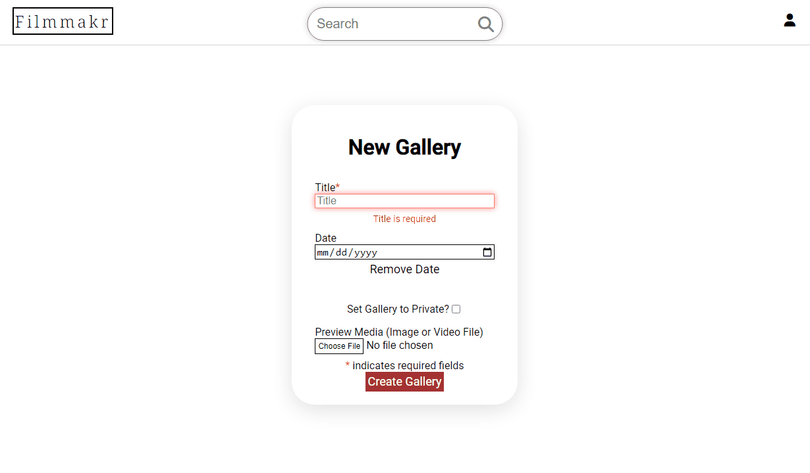

# Filmmakr

## Live Link

[https://filmmakr.onrender.com/](https://filmmakr.onrender.com/)

### Technologies used

#### Frameworks/Languages

#### Database

#### Other Tools

#### Hosting

## Index

## Example Gallery

## Creating a New Gallery

## Uploading an Item

## Endpoints

## Auth

| Route                                                   | Purpose                                                | Output                                                                                                                                                                               |
| ------------------------------------------------------- | ------------------------------------------------------ | ------------------------------------------------------------------------------------------------------------------------------------------------------------------------------------ |
| `GET /api/auth/`                                        | Authenticates a user                                   | `json {"address": <STRING/>, "birthday": <STRING/>, "email": <STRING/>, "username":<STRING/> ,"id": <INT/>, "first_name": <STRING/>, "last_name": <STRING/>, "orders": [<orders/>]}` |
| `POST /api/auth/login`                                  | Logs a user in                                         | `json {"address": <STRING/>, "birthday": <STRING/>, "email": <STRING/>, "username":<STRING/> ,"id": <INT/>, "first_name": <STRING/>, "last_name": <STRING/>, "orders": [<orders/>]}` |
| `GET /api/auth/logout`                                  | Logs a user out                                        | `json {"message": "User logged out"}`                                                                                                                                                |
| `POST /api/auth/signup`                                 | Creates a new user and logs them in                    | `json {"address": <STRING/>, "birthday": <STRING/>, "email": <STRING/>, "username":<STRING/> ,"id": <INT/>, "first_name": <STRING/>, "last_name": <STRING/>, "orders": [<orders/>]}` |
| `GET /api/auth/unauthorized`                            | Returns unauthorized JSON when authentication fails    | `json {"errors": ["Unauthorized"]}`                                                                                                                                                  |
| `GET /api/profiles/<username>`                          | Fetches user's profile                                 | `json {"bio": <STRING/>, "galleries": [<galleries/>], "id": <INT/>, "name": <STRING/>, "profile_pic": <URL/>, "username": <STRING/>, "follows": [<users/>], "following": <users/>}`  |
| `GET /api/profiles/<username>/full`                     | Fetches user's full profile (requires auth)            | Same as above, but includes `json {"email: <STRING/>"}`                                                                                                                              |
| `GET /api/galleries/<int:galleryId>?p=<string:password` | Fetches gallery by ID                                  | `json {"gallery": {"id": <INT/>, "date": <STRING/>, "isPrivate": <BOOLEAN/>, "ownerId": <INT/>, "preview": <URL/>, "title": <STRING/>, "items": [<items/>]}}`                        |
| `POST /api/galleries/new`                               | Posts a new gallery                                    | `json {"gallery": {"id": <INT/>, "date": <STRING/>, "isPrivate": <BOOLEAN/>, "ownerId": <INT/>, "preview": <URL/>, "title": <STRING/>, "items": [<items/>]}}`                        |
| `PUT /api/galleries/<int:galleryId>`                    | Updates a gallery by ID                                | `json {"gallery": {"id": <INT/>, "date": <STRING/>, "isPrivate": <BOOLEAN/>, "ownerId": <INT/>, "preview": <URL/>, "title": <STRING/>, "items": [<items/>]}}`                        |
| `DELETE /api/galleries/<int:galleryId>`                 | Deletes a gallery                                      | `json {"status": "success"}`                                                                                                                                                         |
| `POST /api/galleries/<int:galleryId>/items`             | Creates a new item for a gallery                       | `json {"id": <INT/>, "name": <STRING/>, "type": <FILETYPE/>, "url": <URL/>, "isMain": <BOOLEAN/>}`                                                                                   |
| `PUT /api/items/<int:itemId>`                           | Updates an item by ID                                  | `json {"id": <INT/>, "name": <STRING/>, "type": <FILETYPE/>, "url": <URL/>, "isMain": <BOOLEAN/>}`                                                                                   |
| `DELETE /api/items/<int:itemId>`                        | Deletes an item by ID                                  | `json {"status": "success"}`                                                                                                                                                         |
| `POST /api/follows/<int:userId>`                        | As a logged in user, follow another user by username   | `json {"address": <STRING/>, "birthday": <STRING/>, "email": <STRING/>, "username":<STRING/> ,"id": <INT/>, "first_name": <STRING/>, "last_name": <STRING/>, "orders": [<orders/>]}` |
| `DELETE /api/follows/<int:userId>`                      | As a logged in user, unfollow another user by username | `json {"address": <STRING/>, "birthday": <STRING/>, "email": <STRING/>, "username":<STRING/> ,"id": <INT/>, "first_name": <STRING/>, "last_name": <STRING/>, "orders": [<orders/>]}` |
